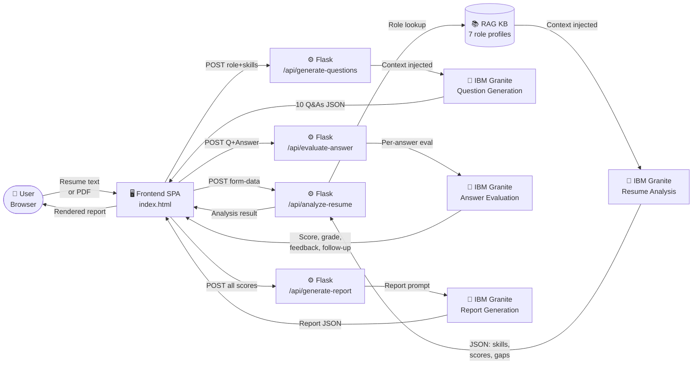

# InterviewIQ – Architecture Blueprint

> AI Interview Trainer · IBM Granite · Flask · RAG · Problem Statement #22

---

## System Layers

| Layer | Technology | Responsibility |
|---|---|---|
| **Frontend** | Vanilla HTML/CSS/JS | SPA with 4 sections: Home, Resume, Interview, Report |
| **Backend** | Flask 3 / Python 3.11 | REST API, PDF extraction, RAG injection, Granite calls |
| **AI Model** | IBM Granite (`ibm/granite-4-h-small`) | Resume analysis, question generation, evaluation, report |
| **RAG** | In-memory knowledge base | Role-specific context injected into every Granite prompt |
| **Auth** | IBM IAM OAuth | API key → Bearer token, cached and auto-refreshed |

---

## End-to-End Data Flow



---

## API Routes

| Method | Endpoint | Description | AI Used |
|---|---|---|---|
| `GET` | `/` | Serves SPA shell (index.html) | — |
| `GET` | `/api/health` | Health check, returns model ID | — |
| `POST` | `/api/analyze-resume` | Resume analysis — skills, scores, gaps | RAG + Granite |
| `POST` | `/api/generate-questions` | 10 questions (technical / behavioral / situational) | RAG + Granite |
| `POST` | `/api/evaluate-answer` | Score 0–10, grade, feedback, follow-up question | Granite |
| `POST` | `/api/generate-report` | Full report — gap table, 6-week plan, hire rec | Granite |

---

## RAG Knowledge Base

7 role profiles stored in-memory in `app.py`. Each profile contains three fields:

| Role | Key Skills | Common Topics |
|---|---|---|
| Data Analyst | SQL, Pandas, Tableau, Statistics, ETL | Window functions, Hypothesis testing |
| Python Developer | OOP, Flask/Django, REST APIs, Testing | Decorators, Async/await, SOLID |
| Software Developer | DSA, Algorithms, System Design, CI/CD | Big-O, CAP theorem, Microservices |
| Business Analyst | Requirements, UML, Agile/Scrum | User stories, Gap analysis, KPIs |
| Power BI Developer | DAX, Power Query, Star Schema, RLS | Calculated columns vs measures |
| AI/ML Engineer | PyTorch, Feature Engineering, MLOps | RAG, Cross-validation, Transformers |
| Other | Problem solving, Communication | General fundamentals |

RAG context is injected into the system/user message of every IBM Granite call to ground responses in role-specific knowledge.

---

## IBM Granite Agentic Calls (per session)

```
Call 1  – Resume Analysis
          Input : resume text (≤3000 chars) + RAG context
          Output: JSON { detected_skills, strengths, areas_to_improve,
                         role_relevance_score, readiness_score, ... }

Call 2  – Question Generation
          Input : role + experience + skills + RAG context
          Output: JSON { technical[5], behavioral[3], situational[2] }

Calls 3–12 – Per-Answer Evaluation  (one call per question answered)
          Input : question + candidate answer + role
          Output: JSON { score/10, grade, strengths, improvements,
                         model_answer_hint, follow_up }

Call 13 – Final Report Generation
          Input : candidate name + role + all scores array
          Output: JSON { overall_score, skill_gap_analysis[],
                         improvement_plan[], recommended_resources[] }
```

---

## Technology Stack

| Layer | Technology | Details |
|---|---|---|
| AI Model | IBM Granite | `ibm/granite-4-h-small` · watsonx.ai · us-south |
| Backend | Flask 3 / Python 3.11 | REST API, Jinja2, Werkzeug, PyPDF2 |
| Frontend | Vanilla HTML/CSS/JS | Dark SaaS SPA, Fetch API, no frameworks |
| RAG | In-memory dictionary | 7 role profiles, injected at call time |
| Auth | IBM IAM OAuth | `urn:ibm:params:oauth:grant-type:apikey` |
| Config | python-dotenv | `.env` — API key, project ID, model ID |
| WSGI | Waitress / Gunicorn | 4 threads, Windows + Linux compatible |
| File I/O | PyPDF2 + Werkzeug | Secure upload, server-side PDF text extraction |

---

## Project File Structure

```
Interview_Agent/
├── app.py                          # Flask app + all API routes + Granite integration
├── server.py                       # Production Waitress entry point
├── requirements.txt
├── .env                            # IBM credentials (not committed)
├── README.md
├── templates/
│   └── index.html                  # SPA shell (4 sections)
├── static/
│   ├── css/style.css               # Premium dark SaaS theme
│   └── js/app.js                   # Frontend state + API calls
├── uploads/                        # Temp PDF upload folder (auto-created)
└── docs/
    └── architecture/
        ├── blueprint.md            # This file
        └── blueprint.html          # Visual HTML blueprint
```

---

*Powered by IBM Granite · IBM watsonx.ai · Made with IBM Bob*
