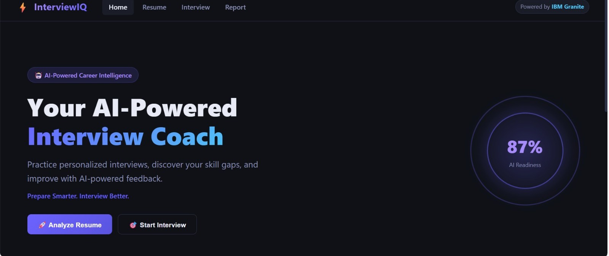
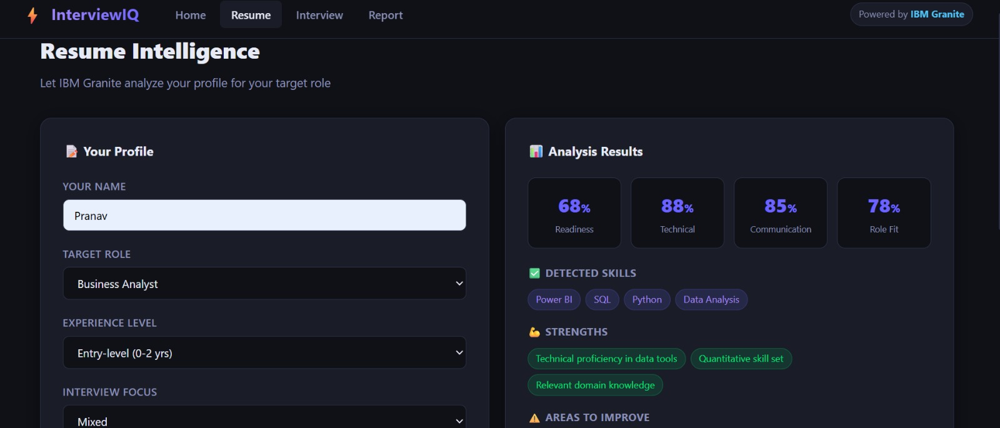
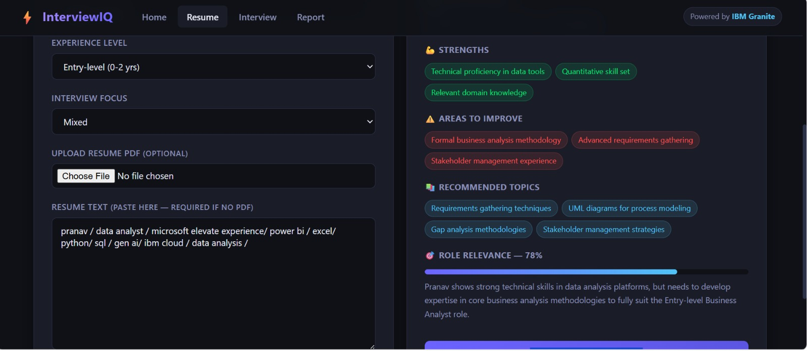
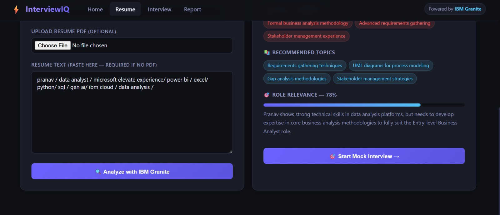
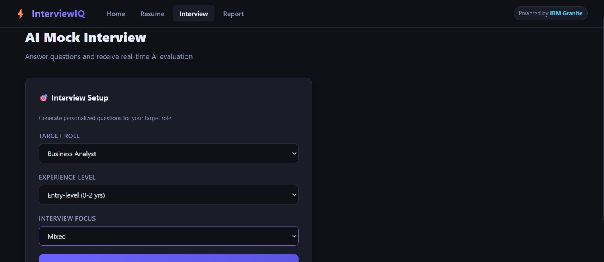
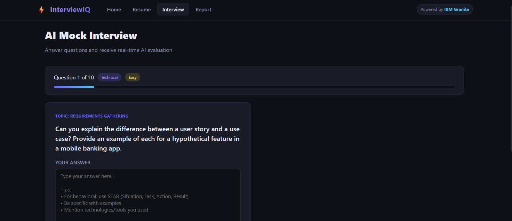
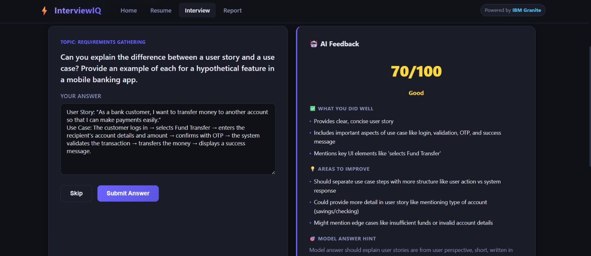
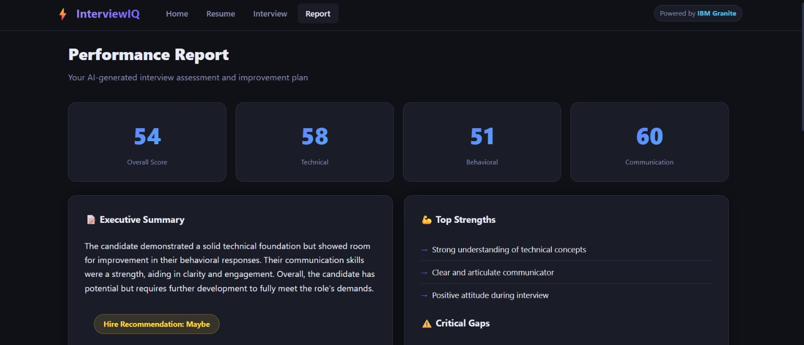
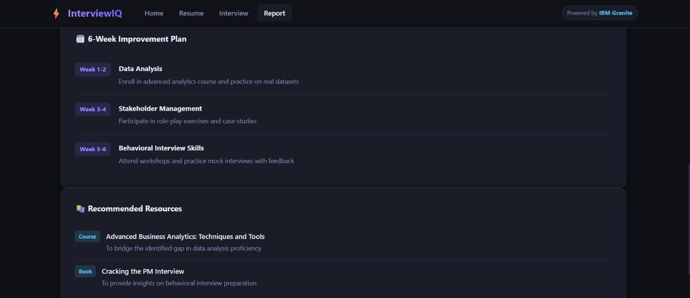

# InterviewIQ – Complete Project Workflow

InterviewIQ is an AI-powered interview preparation platform that uses IBM Granite to analyze a candidate's profile, generate personalized interview questions, evaluate answers, and provide a performance report with an improvement plan.

## End-to-End Workflow

The complete workflow of InterviewIQ is:

**Candidate Profile → Resume Intelligence → AI Analysis → Personalized Interview → AI Evaluation → Performance Report → Improvement Plan**

---

## 0. InterviewIQ Landing Page

The landing page introduces InterviewIQ as an AI-powered interview trainer and provides navigation to the Resume, Interview, and Report sections.



---

## 1. Resume Intelligence

The candidate provides their name, target role, experience level, interview focus, and resume information.

The system analyzes the candidate profile and identifies:

- Detected skills
- Strengths
- Areas to improve
- Recommended interview topics
- Role relevance
- Readiness score
- Technical score
- Communication indicators



---

## 2. AI Resume Analysis Results

IBM Granite analyzes the candidate profile according to the selected target role and provides personalized insights.

The results help identify the candidate's current strengths and preparation gaps before starting the mock interview.



---

## 3. Resume Analysis to Mock Interview

After analyzing the candidate profile, InterviewIQ provides personalized recommendations and allows the candidate to proceed directly to the mock interview.

The recommended topics and identified gaps are used to prepare the candidate for the next stage.



---

## 4. Interview Setup

The candidate selects:

- Target role
- Experience level
- Interview focus

InterviewIQ then generates personalized questions based on the selected configuration and candidate profile.



---

## 5. AI Mock Interview

InterviewIQ presents one question at a time and tracks the candidate's progress through the interview.

Questions are personalized according to the target role, experience level, skills, and interview focus.

The candidate submits an answer and receives AI-based evaluation.



---

## 6. AI Feedback and Answer Evaluation

IBM Granite evaluates the candidate's answer and provides:

- Score
- Overall assessment
- What the candidate did well
- Areas to improve
- Model answer guidance

This creates a real-time feedback loop that helps the candidate understand how to improve their responses.



---

## 7. Performance Report

After completing the interview, InterviewIQ generates an AI-powered performance report.

The report provides:

- Overall score
- Technical score
- Behavioral score
- Communication score
- Executive summary
- Top strengths
- Critical gaps
- Hiring recommendation



---

## 8. Personalized Improvement Plan

InterviewIQ converts the identified performance gaps into a structured improvement plan.

The plan provides focused activities across multiple weeks and recommends learning resources to help the candidate improve their interview readiness.



---

## Complete Workflow Summary

```text
Candidate
   │
   ▼
InterviewIQ Landing Page
   │
   ▼
Resume Intelligence
   │
   ├── Skills
   ├── Strengths
   ├── Areas to Improve
   └── Role Relevance
   │
   ▼
IBM Granite Analysis
   │
   ▼
Personalized Interview Setup
   │
   ▼
AI Mock Interview
   │
   ▼
Answer Evaluation
   │
   ▼
AI Feedback
   │
   ▼
Performance Report
   │
   ├── Scores
   ├── Strengths
   └── Critical Gaps
   │
   ▼
Personalized Improvement Plan
   │
   ▼
Recommended Resources
